# LaunchLense Product and Engineering Analysis

## Executive Summary

LaunchLense is an agentic launch validation canvas that turns a startup idea into research, channel readiness, creative, landing, campaign evidence, verdict, report, and post-sprint activation. The product has evolved significantly from its Meta-focused origins into a comprehensive validation operating system with multi-channel support, intelligent calibration, and real-time monitoring.

The strongest direction is the canvas-based workflow. It makes the product feel like an operating system for validating startup ideas rather than a form-based campaign builder. The main product risk is complexity: the user experience must keep the workflow visually clear, explain what each agent is doing, and avoid exposing implementation friction like OAuth setup, blocked states, or raw CSV semantics without strong guidance.

**Major recent additions:**
- Creative approval system with policy scanning and state machine
- Intelligence dashboard with calibration, accuracy tracking, and verdict analytics
- Demand validation system with deterministic scoring
- Video brief generation for TikTok
- Payment/checkout flow with Stripe integration
- Real-time sprint monitoring via cron jobs
- PostHog analytics integration
- Server-side orchestrator for fault-tolerant pipeline execution

---

## Comprehensive architecture and product inventory (master reference)

Use this section as the **single overview** for architecture, shipped scope, APIs, and product approach (investors, onboarding, handoff).

### Product thesis and approach

- **Thesis**: Replace slow “ship an MVP first” cycles with **fast, evidence-backed validation** across paid channels: research → readiness → messaging → landing → campaign evidence → **verdict** → artifacts, plus optional **activation** (Google Sheets → Gmail outreach → Slack).
- **Mechanism**: Each sprint is a **state machine** persisted in Supabase. Stages are **agents** (Groq-backed structured JSON + rules + external APIs) that read prior outputs and write into the sprint row. The **canvas** is the navigational metaphor; **GET/PATCH `/api/sprint/[id]`** and agent POST routes are the operational truth.
- **UX philosophy**: Nodes convey **status and headline outputs**; the side panel holds **controls, previews, and logs**. Progressive disclosure can hide downstream nodes until the sprint reaches relevant states. Integrations can appear as **optional floating nodes**, visually separate from the core pipeline.
- **Production realities**: Google OAuth requires verification / test users for restricted scopes; outbound APIs (SerpAPI, Meta, Groq) depend on keys, quotas, and latency — failures degrade gracefully where coded (e.g. Genome partial data).

### High-level architecture

```mermaid
flowchart TB
  subgraph client["Client — Next.js App Router"]
    Canvas["Sprint canvas — React Flow"]
    Panel["Node panel"]
    Store["Zustand — UI state"]
    Intel["Intelligence dashboard"]
  end
  subgraph edge["Edge — Route Handlers"]
    SprintAPI["/api/sprint/*"]
    IntegAPI["/api/integrations/google/*"]
    CronAPI["/api/cron/*"]
    IntelAPI["/api/intelligence/*"]
    PaymentAPI["/api/sprint/*/checkout"]
  end
  subgraph data["Data"]
    SB[(Supabase PostgreSQL)]
    Events[sprint_events]
    Creatives[sprint_creatives]
    IntelData[intelligence_views]
  end
  subgraph agents["Agents — lib/agents/*"]
    Genome[GenomeAgent]
    HG[Healthgate]
    Angle[AngleAgent]
    Video[VideoBrief]
    Verdict[VerdictAgent]
    Sheet[SpreadsheetAgent]
    OutReach[Outreach]
    SlackA[Slack]
  end
  subgraph systems["Systems — lib/*"]
    Policy[Policy scanner]
    Demand[Demand validation]
    Orch[Orchestrator]
    Analytics[PostHog events]
  end
  subgraph ext["External APIs"]
    Groq[Groq LLM]
    Serp[SerpAPI search]
    MetaG[Meta Graph / Ad Library]
    GoogleAP[Gmail and Sheets]
    Stripe[Stripe payments]
  end
  Canvas --> SprintAPI
  Panel --> SprintAPI
  Intel --> IntelAPI
  SprintAPI --> SB
  SprintAPI --> agents
  SprintAPI --> Policy
  SprintAPI --> Demand
  SprintAPI --> Orch
  SprintAPI --> PaymentAPI
  agents --> Groq
  Genome --> Serp
  Genome --> MetaG
  Sheet --> GoogleAP
  OutReach --> GoogleAP
  PaymentAPI --> Stripe
  SprintAPI --> Events
  SprintAPI --> Creatives
  agents --> Analytics
```

### Technology stack

| Layer | Choices |
| --- | --- |
| App | Next.js App Router, React, TypeScript |
| Canvas | `@xyflow/react`, custom nodes/edges, light Framer Motion |
| Client state | React state + Zustand (`lib/store.ts`) + SWR for creatives/intelligence |
| Database | Supabase / Postgres; server uses service client |
| LLM | Groq (`lib/groq.ts`) for agent JSON |
| Research | `lib/market-research.ts` — SerpAPI + Meta Ad Library |
| Google | OAuth (`lib/google/*`), Sheets (`fetch-sheet`), Gmail (`send-gmail`), encrypted tokens |
| Meta | Auth callbacks, webhooks, uploads (`lib/meta.ts`, related routes) |
| Payments | Stripe (`lib/stripe-server.ts`, checkout flow) |
| Policy | `lib/policy/scan.ts` — ad compliance scanner for Meta/Google/LinkedIn/TikTok |
| Demand validation | `lib/demand-validation/*` — deterministic scoring, memo building |
| Analytics | PostHog (`lib/analytics/*`) — event tracking, intelligence data |
| Orchestrator | `lib/orchestrator.ts` — server-side fault-tolerant pipeline execution |
| Creative store | `lib/creatives/store.ts` — status state machine, CRUD operations |
| Intelligence | `components/intelligence/*` — calibration charts, accuracy tracking, verdict analytics |
| Video brief | `lib/agents/video-brief.ts` — TikTok content generation |
| Cron jobs | `app/api/cron/*` — health, metrics, sprint monitoring, verdict dispatch |

### Sprint state machine

States (`SprintState` in `lib/agents/types.ts`):  
`IDLE` → `GENOME_RUNNING` → `GENOME_DONE` → `HEALTHGATE_RUNNING` → `HEALTHGATE_DONE` → `PAYMENT_PENDING` → `ANGLES_RUNNING` → `ANGLES_DONE` → `USER_REVIEW_REQUIRED` → `CREATIVE_APPROVED` → `LANDING_RUNNING` → `LANDING_DONE` → `CAMPAIGN_CREATING` → `CAMPAIGN_RUNNING` → `CAMPAIGN_MONITORING` → `VERDICT_GENERATING` → `COMPLETE`; **`BLOCKED`** halts with `blocked_reason`.

**Key new states:**
- `PAYMENT_PENDING`: Pauses workflow until Stripe checkout completes
- `USER_REVIEW_REQUIRED`: v10 approval gate — user must approve at least one creative per active channel
- `CREATIVE_APPROVED`: Unlocks landing and campaign deployment steps

Server orchestration primitives: `lib/sprint-machine.ts` (`dispatchGenome`, `dispatchHealthgate`, `dispatchAngles`, …) and `lib/orchestrator.ts` (server-side fault-tolerant pipeline). The UI may invoke routes in sequence; durable server-side job queues remain a roadmap upgrade.

### Data model (conceptual)

One **`sprints`** row holds scalars (`idea`, `state`, `active_channels`, `budget_cents`, …) plus JSON blobs: **`genome`**, **`healthgate`**, **`angles`**, **`landing`**, **`campaign`**, **`verdict`**, **`report`**, **`integrations`**, **`post_sprint`**.

**`sprint_events`** stores audit rows (agent, event_type, payload) for timelines and integration logs.

**`sprint_creatives`** stores one row per (sprint, angle, platform) with:
- Editable fields: `headline`, `primary_text`, `description`, `cta`, `image_url`, `video_url`
- Status state machine: `draft` → `reviewing` → `approved` → `deploying` → `deployed`/`failed`
- Policy scan results: `policy_severity`, `policy_issues`
- Metadata: `meta` (free-form extension data)

**Intelligence views** (materialized or query-based) power the analytics dashboard:
- Sprint-level verdict distribution
- Genome accuracy over time
- Per-vertical performance
- Calibration scatter plot data

Trade-off: flexible JSON speeds iteration; cap large inline assets (e.g. creative images) to avoid PATCH/DB failures — prefer blob storage at scale.

### Agent inventory

| Capability | Purpose | Persisted mainly under |
| --- | --- | --- |
| GenomeAgent | Pre-screen idea (scores, composite, GO/ITERATE/STOP, risks) | `genome` |
| Healthgate | Per-channel readiness | `healthgate` |
| AngleAgent | Channel-aware messaging angles | `angles` |
| VideoBrief | TikTok video content generation (script, hook, broll ideas) | `angles` (video brief data) |
| Landing flow | Landing narrative / deploy | `landing` |
| Campaign | Spend / monitoring semantics | `campaign` |
| VerdictAgent | Aggregate channel verdict + demand validation | `verdict`, `demand_validation` |
| Report | Summary artifact readiness | `report` |
| SpreadsheetAgent | Sheet or CSV → contacts | `post_sprint`, client session for edits |
| Outreach | Gmail sends + logs | `post_sprint`, events |
| Slack agent | Channel post | `post_sprint`, events |

### HTTP API inventory (representative)

**Core sprint**: `GET`/`POST` `/api/sprint`; `GET`/`PATCH` `/api/sprint/[id]`; `POST` `.../genome`, `.../healthgate`, `.../angles`, `.../override-stop`, `.../campaign/start`, `.../demo-complete`, `.../verdict`, `.../video-brief`.

**Creative approval**: `GET`/`PATCH` `/api/sprint/[id]/creatives`; `POST` `.../creatives/[angle_id]/[platform]/scan`, `.../approve`, `.../reject`, `.../regenerate`.

**Payment**: `POST` `/api/sprint/[id]/checkout`; `GET` `/api/sprint/[id]/payment-status`.

**Post-sprint**: `.../post-sprint/prepare-sheet`, `send-outreach`, `post-slack`.

**Intelligence**: `GET` `/api/intelligence` (with org_id param); `GET` `/api/intelligence/predictions/*`.

**Google**: `/api/integrations/google/start`, `callback`, `status`, `disconnect`.

**Meta / ops**: `/api/auth/meta/*`, `/api/webhooks/meta`, upload routes; **`/api/cron/*`** for monitors/metrics/verdict/health.

**Legacy / utilities**: `/api/tests/*`, `/api/reports/*`, `/api/accounts`, `/api/lp/deploy`, `/api/policy/scan`, `/api/qa`, `/api/ai/*`, `/api/angle/*`, etc.

Dynamic landing delivery may live under `app/lp/[test_id]/route.ts`.

### Frontend map

- **`/canvas`** — empty hub; **`/canvas/[id]`** — deep-link sprint.
- **`sprint-canvas.tsx`** — graph layout, progressive visibility, edges, toolbar wiring.
- **`canvas-nodes.tsx`** — node visuals and stages.
- **`node-panel.tsx`** — Genome logs, creatives, integrations, outreach, spreadsheet UX, creative approval workspace.
- **`canvas-toolbar.tsx`** — sprint selector, new sprint, global panels.
- **`intelligence-dashboard.tsx`** — analytics dashboard with calibration charts, accuracy tracking, verdict distribution, live verdict feed.
- **`creative-approval-workspace.tsx`** — single-source creative approval UI with angle/channel tabs, policy scanning, approve/reject/regenerate actions.
- **`creative-editor.tsx`** — per (angle, platform) creative editing form with field limits, policy block, scan/approve actions.

### Metrics vocabulary (product language)

Terms aligned with positioning: **CTR, CPM, CPC, CPA, ROAS**, impressions, spend, frequency — tied to campaign/verdict storytelling where implemented — alongside workflow terms (**composite**, **signal**, **healthgate**, **verdict**, **GO / ITERATE / STOP / NO-GO**).

**Demand validation terms**: **confidence_score**, **ctr_score**, **conversion_score**, **consistency_score**, **efficiency_score**, **market_signal_strength** (WEAK/MODERATE/STRONG), **data_completeness_factor**, **benchmark_comparison** (ctr_position, conversion_position, cpc_position).

### Security and compliance (summary)

Server-held OAuth secrets; encrypted token storage; Gmail rate limiting; Google verification for production scopes; minimize persisted PII in sprint JSON; explicit user consent for outreach.

### Known architectural tensions

- Browser-driven sequencing vs durable workers for long pipelines.
- External API flakiness (SerpAPI timeouts, Meta quotas).
- Creative fidelity vs payload size without object storage.

---

## Product Positioning

LaunchLense promises faster startup validation by replacing slow MVP cycles with fast demand tests. The product is strongest when positioned as:

- A validation sprint system for founders, venture studios, and growth operators.
- A risk reducer before spending real ad budget.
- A single place to generate evidence, creative, landing pages, verdicts, and follow-up outreach.

The canvas supports this positioning well because it visually communicates an agentic pipeline:

1. Accounts
2. Genome
3. Healthgate
4. Angles
5. Creative
6. Landing
7. Campaign
8. Verdict
9. Report
10. Spreadsheet
11. Outreach
12. Slack

This sequence is understandable and demo-friendly. The key product requirement is to keep every node informative enough to prove work is happening, without overwhelming the user.

## Current UI Analysis

### Canvas

The canvas is the primary workspace. It uses React Flow with custom nodes and custom pipeline edges. The node-based interface is appropriate because the product is inherently sequential and agent-driven.

Current strengths:

- The workflow is visually understandable.
- Node statuses communicate queued, running, done, blocked, and review states.
- Success and failure badges on nodes create a clear sense of progress.
- Dynamic channel lanes allow Meta, Google, LinkedIn, and TikTok to appear only when active.
- The panel-on-node-click interaction keeps detail views close to the workflow.

Current weaknesses:

- Horizontal and vertical spacing need careful tuning because too much compression makes the workflow feel crowded, while too much spacing makes the pipeline feel disconnected.
- Utility nodes such as Benchmarks and Settings should stay secondary and not compete visually with the main workflow.
- The canvas should avoid visible implementation artifacts such as connector handle dots.
- Panel transitions should stay simple. When switching nodes, the panel should update content without replaying a vertical or remount animation.

Recommended UI direction:

- Keep the main workflow horizontally separated enough to read each stage.
- Keep channel-specific lanes vertically compact but not overlapping.
- Preserve simple line connectors without arrowheads, moving dots, or visible handles.
- Treat the side panel as a persistent inspector rather than a modal that re-enters on every click.

### Nodes

The nodes are the product's strongest visual metaphor. Each node should answer three questions:

- What agent or stage is this?
- What is its status?
- What useful output did it produce?

Recommended node-specific expectations:

- Accounts: connected platform count and readiness.
- Genome: composite score, signal, live research sources, observed signals, and run log.
- Healthgate: per-channel score, pass/warn/block state, top blocking issues.
- Angles: selected angle count, archetypes, emotional levers.
- Creative: channel-specific copy and lightweight visual preview.
- Landing: page mode, headline, CTA, deployment status.
- Campaign: spend, CTR, monitoring or launch status.
- Verdict: GO, ITERATE, or NO-GO with confidence.
- Report: readiness and report access.
- Spreadsheet: contact count, source, processing summary, and sent email preview after outreach.
- Outreach: sent count, failures, first failure reason, Gmail sender.
- Slack: posted state and target channel.

### Side Panel

The side panel is the detail inspector for each node. Its role is to provide detailed control and logs without forcing the canvas itself to become dense.

Current strengths:

- It supports rich node-specific configuration.
- Spreadsheet and Outreach panels now support contact review, email editing, preview, and sending.
- Genome logs and source visibility make the agent feel more transparent.

Current risks:

- The panel is large and contains many inline styles, which makes long-term maintenance harder.
- The Spreadsheet panel is feature-rich and could become heavy if it renders many contacts or full HTML previews at large scale.
- Repeated panel remounts or animation changes can make the canvas feel laggy.

Recommended direction:

- Keep the panel mounted while switching node content.
- Prefer lightweight text previews for persisted sent emails.
- Use virtualization if contact lists grow beyond a few hundred rows.
- Extract repeated panel UI primitives only when they reduce real duplication.

## Feature Analysis

### Creative Approval System

Purpose:

- Provides a structured approval workflow for creatives before campaign deployment
- Enforces policy compliance scanning across Meta, Google, LinkedIn, and TikTok
- Implements a status state machine (draft → reviewing → approved → deploying → deployed/failed)
- Seeds creative rows automatically when angles are generated
- Locks angle selection to the selected angle from the angles node

Strengths:

- Single source of truth for creative state in `sprint_creatives` table
- Status state machine prevents invalid transitions
- Policy scanner catches common ad rejections before API quota is burned
- Angle selection locking prevents user confusion between angles node and creative panel
- Optimistic editing with debounced PATCH requests for smooth UX
- Angle selection locked to angles node selection ensures consistency

Risk:

- Large base64 creative images can overload persistence
- Policy scanner rules may need continuous updates as platform policies change
- User may not understand why certain creatives are blocked by policy

Recommendation:

- Move large creative assets to object storage at scale
- Keep policy rules specific and well-documented
- Show clear policy issue explanations in the UI
- Continue using the sprint's selected_angle_id for image upload to ensure consistency

### Intelligence Dashboard

Purpose:

- Provides analytics and calibration data across all sprints
- Shows Genome accuracy over time
- Displays verdict distribution (GO/ITERATE/NO-GO breakdown)
- Provides per-vertical performance analysis
- Shows calibration scatter plot for predicted vs actual outcomes
- Live verdict feed for real-time sprint completion visibility

Strengths:

- Enables data-driven decision making about validation accuracy
- Helps users understand system performance and trustworthiness
- Calibration scatter plot shows correlation between predictions and outcomes
- Paywall can monetize advanced analytics features

Risk:

- Requires sufficient sprint volume for meaningful analytics
- May reveal accuracy issues that could hurt trust if not managed well
- Performance concerns with large sprint datasets

Recommendation:

- Show confidence intervals and sample sizes for all metrics
- Use paywall strategically for advanced features while keeping basic insights accessible
- Implement caching and pagination for intelligence queries
- Continue adding calibration features to improve prediction accuracy over time

### Demand Validation System

Purpose:

- Provides deterministic scoring for campaign performance
- Computes CTR, conversion, consistency, and efficiency scores
- Generates demand validation memo with benchmark comparisons
- Determines aggregate verdict (GO/ITERATE/NO-GO) based on confidence scores
- Classifies market signal strength (WEAK/MODERATE/STRONG)

Strengths:

- Deterministic rules ensure consistency and reproducibility
- Multi-factor scoring (CTR, conversion, consistency, efficiency) provides nuanced assessment
- Benchmark comparisons contextualize performance
- Data completeness factor accounts for partial spend scenarios
- Clear confidence thresholds for verdict determination

Risk:

- Thresholds may need calibration based on actual campaign data
- Benchmark data may not be available for all verticals
- Deterministic rules may not capture edge cases

Recommendation:

- Continuously calibrate thresholds based on real campaign outcomes
- Allow users to provide custom benchmarks when available
- Monitor verdict accuracy and adjust scoring rules as needed
- Keep scoring logic transparent and well-documented

### Video Brief Agent

Purpose:

- Generates TikTok video content including 30s script, hook, broll ideas, and Spark Ads notes
- Provides creative direction for TikTok campaigns
- Leverages angle copy to generate platform-specific content

Strengths:

- Extends creative generation to video format
- Provides actionable creative direction for TikTok
- Integrates with existing angle system

Risk:

- Limited to TikTok platform (not yet expanded to other video platforms)
- Quality depends on LLM output consistency
- May require human review before production use

Recommendation:

- Expand to other video platforms (LinkedIn Video, YouTube Shorts) in future
- Add human review step before video production
- Track video performance to improve prompts over time

### Payment/Checkout Flow

Purpose:

- Integrates Stripe for payment processing
- Pauses workflow at PAYMENT_PENDING state until checkout completes
- Provides payment status tracking
- Enables monetization of validation sprints

Strengths:

- Enables revenue generation from validation services
- Clean integration with existing state machine
- Payment status tracking provides visibility

Risk:

- Stripe integration adds complexity and dependency
- Payment friction may reduce conversion rate for validation
- Need to handle payment failures gracefully

Recommendation:

- Provide clear value proposition before payment gate
- Offer free tier or trial for new users
- Handle payment failures with helpful error messages and recovery paths
- Consider subscription model for frequent validators

### GenomeAgent

Purpose:

- Quickly evaluates the startup idea using live or estimated market signals.
- Produces a signal, composite score, market category, ICP, problem statement, wedge, risks, and sources.

Strengths:

- Gives the workflow a strong first step.
- Makes the product feel research-driven instead of just campaign-driven.
- Live search sources and logs improve trust.

Risk:

- If Genome returns STOP too early, users may feel the workflow is broken. This is especially risky in demos.

Recommendation:

- Keep STOP visible as a serious signal, but allow explicit user override for demo and founder judgment.
- Explain the reason for STOP directly inside the Genome node and panel.

### Healthgate

Purpose:

- Checks whether ad channels are ready before spending money.
- Prevents bad account state from creating misleading validation results.

Strengths:

- Strong product differentiation.
- Makes LaunchLense feel safer and more professional.
- Multi-channel health checks align with the long-term roadmap.

Risk:

- Mock or demo health data must be clearly separated from real account data.

Recommendation:

- Show whether checks are live, mocked, or estimated.
- Keep per-channel blocking issues visible.

### Angle and Creative Generation

Purpose:

- Converts the validated idea into testable messaging.
- Produces channel-specific creative previews.

Strengths:

- Gives the workflow visible output quickly.
- Supports multiple channels and formats.
- Makes demos feel tangible.

Risk:

- Large inline creative images can overload persistence and APIs.

Recommendation:

- Continue storing only lightweight creative state.
- Move large assets to object storage if persistent creative images are needed.

### Landing Page

Purpose:

- Generates or edits a destination page for validation traffic.

Strengths:

- Supports builder and code modes.
- Connects campaign validation to a real destination.

Risk:

- Landing page generation and deployment can become a large feature surface.

Recommendation:

- Keep the canvas node focused on status and preview.
- Keep advanced editing in the panel or a dedicated editor route.

### Campaign and Verdict

Purpose:

- Launches or simulates campaign activity.
- Produces a final validation verdict and report.

Strengths:

- Closes the core validation loop.
- Verdict and report make the product outcome concrete.

Risk:

- Real ad platform API constraints and app review status can block a fully live experience.

Recommendation:

- Make live vs demo campaign state explicit.
- Keep verdict reasoning grounded in campaign metrics, not generic LLM output.

### SpreadsheetAgent

Purpose:

- Prepares post-sprint contacts from CSV or Google Sheets.
- Normalizes contact rows and enables outreach review.

Strengths:

- Extends LaunchLense beyond validation into activation.
- Google Sheets integration maps well to real founder workflows.
- Contact review and editing reduces risk before sending.

Risk:

- Users may not understand expected columns unless the UI explains them clearly.
- Large contact lists can create rendering and session storage pressure.

Recommendation:

- Keep the current CSV explanation.
- Continue supporting live Google Sheets pulls.
- Add pagination or virtualization for large contact lists.
- Keep the sent email preview lightweight inside the Spreadsheet node.

### OutreachAgent

Purpose:

- Sends personalized Gmail outreach after contacts are prepared.

Strengths:

- Provides a clear activation step after the validation sprint.
- Uses the connected Gmail sender for authenticity.
- Per-contact send logs and failure reasons improve trust.

Risk:

- Gmail API failures can be opaque unless surfaced directly.
- Sending limits and OAuth verification can affect production reliability.

Recommendation:

- Keep first failure reason visible.
- Keep server-side rate limiting.
- Consider dry-run mode for previews and production-safe demos.

### SlackAgent

Purpose:

- Posts a summary to a chosen Slack channel.

Strengths:

- Good team workflow feature.
- Useful for studios and agencies that validate many ideas.

Risk:

- Needs clean Slack OAuth or bot-token setup before it feels production-ready.

Recommendation:

- Show whether Slack is truly connected or manually marked ready.

## Infrastructure Analysis

### Application Framework

The app uses Next.js App Router with React 19 and TypeScript. This is a strong fit for the product because the UI is interactive and the backend is mostly API-route driven.

Important constraint:

- This project uses Next.js 16. Before changing route behavior, dynamic route handling, or framework APIs, consult the local Next.js docs in `node_modules/next/dist/docs`.

### Data Layer

Supabase stores sprint state, events, integrations, creatives, and agent outputs. The sprint record acts as the workflow state machine source of truth.

**Tables:**
- `sprints` — main sprint state machine
- `sprint_events` — audit rows for timelines and integration logs
- `sprint_creatives` — one row per (sprint, angle, platform) with creative state and policy scan results
- Intelligence views — materialized or query-based views for analytics dashboard

Strengths:

- JSON fields allow fast iteration on agent outputs.
- `sprint_events` provides auditability and agent logs.
- `sprint_creatives` table provides structured creative state with status machine.
- Server routes can update state incrementally.

Risks:

- Large JSON payloads can cause API or database failures.
- Too much state in one sprint record can become difficult to manage.
- Base64 creative images in sprint_creatives can bloat storage.

Recommendations:

- Keep large assets out of sprint JSON and sprint_creatives.
- Move creative images to object storage at scale.
- Continue using event rows for logs.
- Consider separate tables for large outreach batches if scale increases.

### API Layer

The product uses Next.js API routes for sprint orchestration and integrations.

**Important routes:**
- `POST /api/sprint` creates a sprint.
- `GET /api/sprint` lists sprints.
- `GET /api/sprint/[sprint_id]` loads sprint detail.
- `POST /api/sprint/[sprint_id]/genome` runs GenomeAgent.
- `POST /api/sprint/[sprint_id]/healthgate` runs Healthgate.
- `POST /api/sprint/[sprint_id]/angles` runs AngleAgent.
- `POST /api/sprint/[sprint_id]/video-brief` runs VideoBrief.
- `GET /api/sprint/[sprint_id]/creatives` lists creatives.
- `PATCH /api/sprint/[sprint_id]/creatives/[angle_id]/[platform]` updates creative.
- `POST /api/sprint/[sprint_id]/creatives/[angle_id]/[platform]/scan` runs policy scanner.
- `POST /api/sprint/[sprint_id]/creatives/[angle_id]/[platform]/approve` approves creative.
- `POST /api/sprint/[sprint_id]/creatives/[angle_id]/[platform]/reject` rejects creative.
- `POST /api/sprint/[sprint_id]/creatives/[angle_id]/[platform]/regenerate` regenerates creative.
- `POST /api/sprint/[sprint_id]/checkout` initiates Stripe checkout.
- `GET /api/sprint/[sprint_id]/payment-status` checks payment status.
- `POST /api/sprint/[sprint_id]/post-sprint/prepare-sheet` runs SpreadsheetAgent.
- `POST /api/sprint/[sprint_id]/post-sprint/send-outreach` runs OutreachAgent.
- `GET /api/intelligence` loads intelligence dashboard data.

Recommendations:

- Keep every API error JSON-shaped so the client never fails on empty responses.
- Persist enough failure context for users to understand what happened.
- Avoid silently simulating real sends unless the UI marks simulation mode clearly.
- Implement rate limiting for intelligence queries to prevent abuse.

### OAuth and External APIs

Integrations include Google OAuth, Gmail API, Google Sheets API, Meta APIs, Serper or live search signals, Slack, and Stripe.

Strengths:

- User-scoped Google connection creates a practical real-world workflow.
- Gmail sending and Sheets reading are high-value post-sprint features.
- Stripe integration enables monetization.
- Policy scanner pre-validates creatives against platform rules.

Risks:

- Google verification and sensitive scopes can block production access.
- OAuth token scope is currently org/sprint oriented, not necessarily per-user.
- Meta app review can block production campaign creation.
- Stripe integration adds payment complexity and compliance requirements.
- Policy scanner rules require ongoing maintenance as platform policies change.

Recommendations:

- Finish Google OAuth publishing and test-user setup.
- Decide whether Gmail tokens are org-scoped or user-scoped.
- Keep setup state visible in the UI, not hidden in documentation.
- Implement Stripe webhook handling for payment confirmation.
- Establish a process for updating policy scanner rules regularly.

### Server-Side Orchestrator

The `lib/orchestrator.ts` provides fault-tolerant, resumable pipeline execution on the server.

Strengths:

- Resumable: starts from current sprint state, skips completed stages
- Fault-tolerant: each stage catches errors and writes BLOCKED
- Observable: writes sprint_events for every transition
- Idempotent: safe to call multiple times on the same sprint
- Separates orchestration from client-side sequencing

Risks:

- Still depends on client to initiate orchestration in many cases
- Long-running pipelines may time out in serverless environments
- No durable job queue yet (roadmap item)

Recommendations:

- Move more orchestration to server-side cron triggers
- Consider Inngest or Supabase Queues for durable job execution
- Implement timeout handling and retry logic
- Add observability for orchestrator execution

## Performance Analysis

Primary performance risks:

- Large contact lists rendered as full DOM.
- Large HTML email previews rendered repeatedly.
- Large base64 creative images persisted or sent through PATCH.
- Frequent React Flow node updates from measured dimensions.
- Panel remount animations when clicking between nodes.
- Intelligence dashboard queries with large sprint datasets.
- Policy scanner running on every creative scan.
- Creative approval workspace rendering multiple angle/channel combinations.

Current mitigations:

- Oversized inline creative images are stripped before persistence.
- Panel switching is simpler and avoids unnecessary entry animation.
- Sent email preview uses lightweight stored text.
- Node layout merges avoid unnecessary updates.
- SWR caching for creatives and intelligence data with refresh intervals.
- Debounced PATCH requests for creative field edits (350ms).
- Angle selection locking reduces unnecessary re-renders.

Recommended next improvements:

- Virtualize contact rows when count exceeds 100.
- Memoize expensive preview computations.
- Move repeated inline styles into shared primitives only where it reduces code.
- Keep edge animations minimal.
- Implement pagination for intelligence dashboard queries.
- Cache policy scan results to avoid redundant scans.
- Consider materialized views for intelligence analytics to improve query performance.
- Add request debouncing for intelligence API calls.

## Deep Canvas Efficiency and Optimization Audit

### Current Interaction Symptoms

The canvas can feel laggy for several reasons that compound:

- React Flow emits frequent position and dimension updates.
- Node data is rebuilt whenever `sprintData`, drafts, connected platforms, or stored positions change.
- The side panel contains large forms, textareas, iframe previews, and contact lists.
- Edge animations and SVG marker definitions add extra DOM and paint work.
- Full sprint reloads happen after agent actions and while polling active workflow states.

The most important optimization principle is to reduce work on every interaction. Dragging a node, clicking another node, or typing into a panel should not cause expensive node rebuilds, heavy preview rendering, or unnecessary network refreshes.

### Canvas Layout and Graph Rendering

Current behavior:

- `buildNodes()` rebuilds all nodes from sprint state.
- `buildEdges()` rebuilds all edges from sprint state.
- `mergeCanvasNodes()` attempts to preserve existing React Flow state while replacing generated data.
- `meaningfulNodeChanges()` filters dimension and position changes to prevent infinite update loops.

Efficiency strengths:

- Node sizes are centralized in `NODE_SIZE`, which keeps layout computation predictable.
- The layout uses a single pass over columns, so horizontal positioning is `O(columns)`.
- Active channel lane layout is `O(activeChannels)`, which is small and bounded by four channels.
- Node overlap resolution is acceptable for this graph because node count is low.

Efficiency risks:

- `resolveNodeOverlaps()` is `O(n^2)`. This is fine for the current graph size, but should not be used for hundreds of nodes.
- `nodeDataLooselyEqual()` uses `JSON.stringify()`. This is acceptable for small node data but can become expensive if node payloads grow.
- `baseNodes` depends on `nodePositions`, so position cache changes can rebuild node objects.
- `fitView` can make spacing changes feel inconsistent because widening the graph may cause the viewport to zoom out.

Recommended improvements:

1. Replace `JSON.stringify()` node comparison with small per-node signatures.
   - Example: compare only `stage`, `metric`, `selectedAngle`, `validCount`, `sent`, and relevant visible fields.
   - Benefit: avoids serializing full creative or landing data.

2. Keep auto-layout nodes free from persisted position cache.
   - Workflow nodes should remain generated from layout.
   - Only utility nodes should preserve manual movement.

3. Consider a dedicated layout object with explicit gaps.
   - Use named gaps like `standardColumnGap`, `wideColumnGap`, `utilityGap`.
   - This makes visual tuning predictable and avoids changing only one edge class by accident.

4. Avoid automatic `fitView` on every graph update.
   - Fit once on sprint load or new sprint creation.
   - Do not refit while agents update states, because this can make the canvas feel like it jumps or lags.

### Edge Rendering

Current behavior:

- Edges use `getBezierPath()` and `BaseEdge`.
- Running edges previously used SVG marker definitions and moving circles.

Efficiency risks:

- SVG markers add definitions and marker painting.
- Animated circles on paths cause continuous animation work.
- Per-edge injected `@keyframes` can create extra style tags and recalculation.

Current improvement:

- Remove marker arrowheads.
- Remove moving edge dots.
- Keep lightweight dashed line animation only if needed for running state.

Recommended improvements:

1. Prefer static edges for most states.
2. Use a single global animation class instead of injecting per-edge keyframes.
3. Keep edge state encoded through stroke, opacity, and dash style only.

### Node Components

Current behavior:

- Nodes are memoized exports.
- The shared `NodeCard` handles status labels, badges, handles, selection, and hover animation.

Efficiency strengths:

- Memoized node components reduce unnecessary re-rendering when props are stable.
- Shared card shell keeps rendering consistent.

Efficiency risks:

- Inline style objects are recreated on every render.
- Framer Motion hover and entry animations exist on every node.
- Hidden handles still exist for React Flow connectivity, but visible handle circles are removed.

Recommended improvements:

1. Move stable style objects outside render where practical.
2. Keep only subtle node animations.
3. Avoid animating every node when only one node changes state.
4. Keep handles invisible but mounted, because React Flow needs them for edge geometry.

### Side Panel

Current behavior:

- The panel conditionally renders a large switch of node-specific content.
- Spreadsheet and Outreach panels include contact editing, email preview, Google OAuth state, send controls, and logs.
- HTML email preview can use an iframe.

Efficiency strengths:

- The panel is outside the main node graph.
- Sent email preview is stored as lightweight text.
- Panel animation was simplified to avoid dramatic remount behavior.

Efficiency risks:

- Contact rows render as full DOM. A large list can create input lag.
- Email body personalization can recompute while typing.
- HTML iframe preview is expensive if updated on every keystroke.
- Large inline styles make extraction and memoization harder.

Recommended improvements:

1. Virtualize contact rows above 100 contacts.
   - Render only visible rows.
   - Keep selected contact state in an indexed map or array.

2. Debounce HTML preview updates.
   - Update plain text immediately.
   - Update iframe `srcDoc` after 150-250ms of inactivity.

3. Memoize personalized preview.
   - Key by `previewContact.email`, `subject`, `body`, and `format`.

4. Split Spreadsheet panel into focused subcomponents.
   - `ContactsSourceCard`
   - `ContactReviewList`
   - `EmailDraftPreview`
   - `SentEmailPreview`

5. Keep sent previews text-only in persisted sprint data.
   - Do not store full HTML or per-recipient bodies in sprint JSON.

### Network and State Updates

Current behavior:

- The client triggers sequential API routes for the workflow.
- Each step refreshes sprint detail from the server.
- Polling runs while sprint state is active.

Efficiency strengths:

- Server remains source of truth.
- Polling interval is moderate.
- Client can show optimistic running state before server completion.

Efficiency risks:

- Sequential client-driven orchestration can stop if the browser tab refreshes or route changes.
- Multiple `GET /api/sprint/[id]` calls can happen during workflow transitions.
- Loading sprint list should not re-run just because active sprint changes.

Recommended improvements:

1. Move full workflow orchestration to a server route or job.
   - Client calls `POST /api/sprint/[id]/run`.
   - Server advances Genome, Healthgate, Angles, and later stages.
   - Client only observes state.

2. Reduce duplicate detail refreshes.
   - Use API responses directly when they include updated sprint state.
   - Only call `loadSprintDetail()` when the response does not include a full record.

3. Use SWR or a small sprint cache.
   - Cache sprint detail by `sprint_id`.
   - Revalidate after actions.

4. Stop polling after terminal states.
   - Terminal states include `ANGLES_DONE`, `LANDING_DONE`, `COMPLETE`, and `BLOCKED` unless the user explicitly continues.

### Data Structures and Algorithms

Recommended data structure changes:

- Use `Map<string, Node>` for current node lookup, already used in merge logic.
- Use stable node signatures instead of full JSON string comparison.
- Store contacts in arrays for order, but keep selected/edited state indexed by row id for large lists.
- Use bounded queues for event logs if rendering logs directly in UI.
- Keep channel layout as compact indexed lanes based on active channels.

Recommended complexity targets:

- Layout: `O(columns + activeChannels)`.
- Node merge: `O(nodes)`.
- Edge build: `O(activeChannels + postSprintNodes)`.
- Contact rendering: `O(visibleRows)`, not `O(allContacts)`.
- Log rendering: `O(recentEvents)`, not `O(allEvents)`.

### Highest Impact Optimization Plan

1. Remove edge markers and moving dots.
   - Immediate visual and paint simplification.

2. Stop remounting/reanimating the panel when switching nodes.
   - Improves click-to-click responsiveness.

3. Replace `JSON.stringify()` node comparisons with signatures.
   - Reduces render overhead as data grows.

4. Virtualize contact lists.
   - Prevents SpreadsheetAgent UI from slowing down with large lists.

5. Move orchestration server-side.
   - Makes new sprint workflows reliable even if the client route changes.

6. Debounce HTML preview.
   - Prevents iframe churn while typing.

## UX Priorities

Highest-priority UX improvements:

1. Make every node show the right output at the right time.
2. Keep layout readable across one, two, three, and four active channels.
3. Avoid visual artifacts such as connector handle circles.
4. Explain blocked states clearly and provide a deliberate continue/override path.
5. Keep Spreadsheet and Outreach safe, editable, and transparent.

## Risk Register

| Area | Risk | Impact | Recommended Mitigation |
| --- | --- | --- | --- |
| OAuth | Google app not verified | Users cannot connect Gmail/Sheets | Publish consent screen, configure test users, verify sensitive scopes |
| Campaigns | Meta app review incomplete | Real campaign launch blocked | Show live/demo state clearly |
| Data | Large JSON payloads | API/database failures | Store large assets externally, move creative images to object storage |
| UI | Canvas overcrowding | Workflow becomes hard to read | Dynamic spacing by node size and channel count |
| Outreach | Gmail failures unclear | Users do not trust sends | Persist per-contact error reasons |
| Contacts | Large lists | Browser lag | Add pagination or virtualization |
| Product | Too many agent details | Users feel overwhelmed | Keep summaries in nodes, details in panels |
| Creative approval | Policy scanner outdated | Creatives blocked incorrectly | Establish regular policy rule update process |
| Creative approval | Angle selection confusion | Users upload to wrong angle | Lock angle selection to angles node selection (already implemented) |
| Intelligence | Low sprint volume | Analytics not meaningful | Show sample sizes and confidence intervals |
| Intelligence | Performance issues with large datasets | Slow dashboard load | Implement pagination, caching, materialized views |
| Payment | Stripe integration complexity | Payment failures | Implement webhook handling, clear error messages, recovery paths |
| Payment | Payment friction | Reduced conversion | Offer free tier/trial, clear value proposition |
| Demand validation | Threshold mis-calibrated | Incorrect verdicts | Continuously calibrate based on real outcomes, allow custom benchmarks |
| Video brief | LLM output inconsistency | Poor video quality | Add human review step, track performance to improve prompts |
| Orchestrator | Long-running pipelines timeout | Incomplete sprints | Implement timeout handling, retry logic, durable job queues |

## Recommended Roadmap

### Immediate

- Keep connector handles hidden.
- Tune workflow spacing visually across different channel counts.
- Ensure new sprint creation always starts the visible workflow.
- Keep sent email preview visible in Spreadsheet after Outreach sends.
- Move creative images to object storage to prevent bloat in sprint_creatives.
- Implement Stripe webhook handling for payment confirmation.

### Near Term

- Add contact list pagination or virtualization.
- Add clearer live/demo labels for external integrations.
- Add more explicit blocked-state recovery UX.
- Consolidate repeated panel UI patterns.
- Implement pagination for intelligence dashboard queries.
- Add materialized views for intelligence analytics to improve query performance.
- Establish regular policy scanner rule update process.

### Mid Term

- Move persistent creative assets to object storage.
- Add per-user Google token scoping if multi-user orgs are important.
- Add production Slack OAuth flow.
- Add better workflow run orchestration server-side so long-running steps do not depend on a single client session.
- Implement durable job queues (Inngest or Supabase Queues) for orchestrator.
- Expand video brief generation to other platforms (LinkedIn Video, YouTube Shorts).
- Add custom benchmark input for demand validation.
- Implement continuous calibration of demand validation thresholds based on real outcomes.

### Long Term

- Expand from Meta-first validation into full multi-channel validation.
- Add cross-channel budget recommendations.
- Add workspace-level reporting across multiple validation sprints.
- Add an AI analyst layer that can answer questions from campaign, landing, and outreach data.
- Implement live signal ingestion from Reddit, Telegram, HN, Product Hunt for continuous demand monitoring.
- Add per-niche embedding memory for similar idea comparison.
- Build ICP discovery engine to generate ranked lists of specific people/communities.
- Add keyboard-first command palette for terminal-like UX.
- Implement watchlist/alerts system for signal shifts.

## Final Assessment

LaunchLense has evolved significantly from its Meta-focused origins into a comprehensive validation operating system. The product now includes:

**Core Validation Pipeline:** Genome → Healthgate → Angles → Creative Approval → Landing → Campaign → Verdict → Report, with optional post-sprint activation (Spreadsheet → Outreach → Slack).

**Major New Capabilities:**
- **Creative Approval System:** Structured workflow with policy scanning, status state machine, and angle selection locking
- **Intelligence Dashboard:** Analytics and calibration with accuracy tracking, verdict distribution, and live verdict feed
- **Demand Validation:** Deterministic scoring with CTR, conversion, consistency, and efficiency metrics
- **Video Brief Generation:** TikTok content generation with scripts, hooks, and broll ideas
- **Payment/Checkout Flow:** Stripe integration for monetization
- **Real-time Monitoring:** Cron jobs for health, metrics, sprint monitoring, and verdict dispatch
- **PostHog Analytics:** Event tracking and intelligence data
- **Server-side Orchestrator:** Fault-tolerant, resumable pipeline execution

**Product Positioning:**
The canvas-based workflow makes LaunchLense feel like an operating system for validating startup ideas rather than a form-based campaign builder. The strongest direction is to continue building toward the "Bloomberg terminal for startup validation" vision with live signal ingestion, learning loops, and terminal-grade UX.

**Key Architectural Strengths:**
- Single source of truth in Supabase with sprint state machine
- Structured creative store with status state machine
- Policy scanner prevents wasted API quota on rejected creatives
- Demand validation provides deterministic, explainable verdicts
- Intelligence dashboard enables data-driven trust and calibration
- Server-side orchestrator improves reliability over client-driven sequencing

**Critical Success Factors:**
1. Keep the workflow visually clear and explain what each agent is doing
2. Maintain policy scanner accuracy with regular rule updates
3. Continuously calibrate demand validation thresholds based on real outcomes
4. Scale intelligence queries with pagination and materialized views
5. Move to durable job queues for long-running pipelines
6. Implement live signal ingestion for continuous demand monitoring
7. Build toward terminal-grade UX with watchlists, alerts, and command palette

The best version of the product is not a dense automation dashboard; it is a clean workflow where each agent produces visible evidence and the user always understands what happened, why it happened, and what to do next. The recent additions—creative approval, intelligence dashboard, demand validation—move the product significantly closer to this vision while maintaining the core canvas metaphor.
